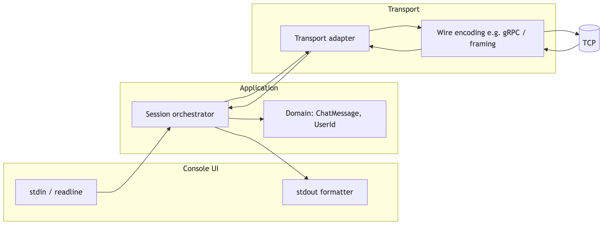
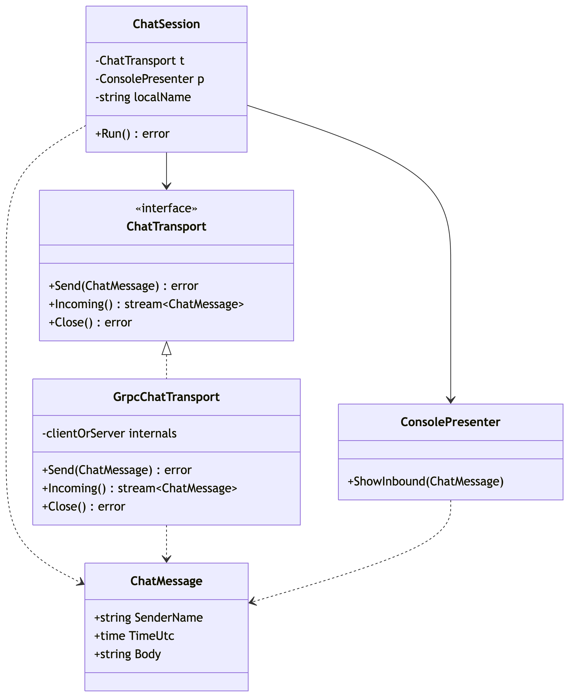
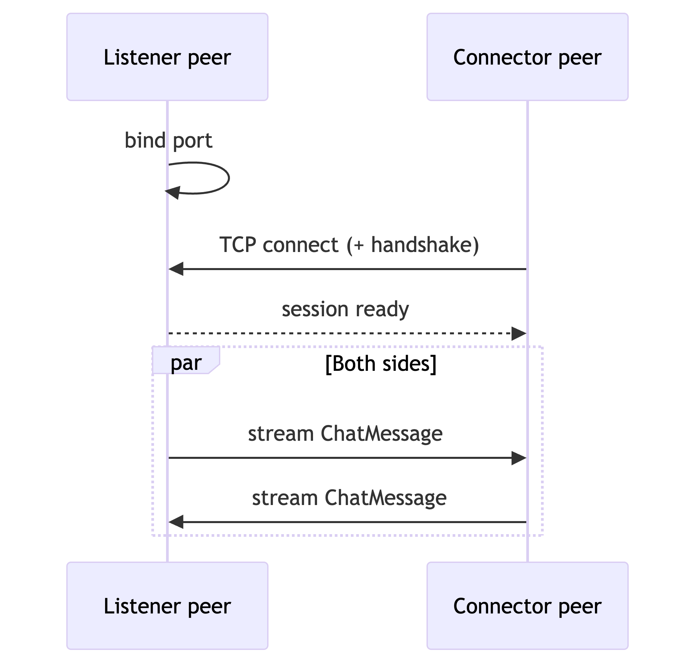

# Архитектура: peer-to-peer сетевой чат (консольный)

## 1. Цели и контекст

**Цель:** консольное приложение для обмена текстовыми сообщениями между двумя участниками по сети **напрямую**, с явным режимом «ожидание подключения» или «подключение к peer-у».

**Роли:** два равноправных peer-а; один выступает **принимающей стороной** (слушает TCP-порт), второй — **инициатором** (подключается по адресу и порту).

## 2. Формализованные требования

### 2.1. Функциональные (FR)

| ID | Требование | Приоритет |
|----|------------|-----------|
| FR-01 | Пользователь задает **свое имя** при запуске | Must |
| FR-02 | Режим **ожидания:** можно не указывать адрес peer-а; приложение **слушает** указанный порт и принимает одно входящее соединение | Must |
| FR-03 | Режим **подключения:** при указании **адреса и порта** peer-а приложение **устанавливает** исходящее соединение | Must |
| FR-04 | После установления сессии пользователи обмениваются **текстовыми сообщениями** в реальном времени (двунаправленно) | Must |
| FR-05 | В консоли отображаются **имя отправителя**, **время отправки** и **текст** каждого входящего сообщения | Must |
| FR-06 | Выход из чата (корректное закрытие соединения и завершение процесса) по явной команде или сочетанию клавиш | Should |
| FR-07 | Обработка обрыва связи (уведомление пользователя, завершение без «зависания» UI) | Should |

### 2.2. Нефункциональные (NFR)

| ID | Требование | Целевой ориентир |
|----|------------|------------------|
| NFR-01 | **Понятность архитектуры:** слабая связанность UI, домена и транспорта | Обязательно для оценки |
| NFR-02 | **Тестируемость:** домен и протокол покрыты unit-тестами; транспорт — по возможности интеграционными/контрактными | Обязательно |
| NFR-03 | **Читаемость кода:** единый стайлгайд (форматтер, линтер), осмысленные границы пакетов/модулей | Обязательно |
| NFR-04 | **Документация:** актуальные диаграммы и краткое обоснование решений в репозитории | Обязательно |
| NFR-05 | Масштаб: **два** участника в одной сессии; чат-комнаты и история на диске **вне MVP** | Явное ограничение |

### 2.3. Вне объема MVP (anti-scope)

- Более двух участников, ретрансляция, NAT traversal (STUN/TURN), шифрование end-to-end (можно запланировать как расширение).
- Графический интерфейс.

## 3. Сценарии 

1. **Peer A (слушатель):** запуск с именем и портом → ожидание → Peer B подключается → обмен сообщениями.
2. **Peer B (клиент):** запуск с именем, хостом и портом A → соединение → обмен сообщениями.

## 4. Диаграмма компонентов

**Назначение компонентов**

| Компонент | Ответственность |
|-----------|-----------------|
| **Console UI** | Чтение строк от пользователя, форматированный вывод входящих сообщений (имя, время, текст); не содержит сетевых деталей. |
| **Session orchestrator** | Жизненный цикл: parse CLI → режим listen/connect → запуск горутин/потоков для приема/отправки → остановка по сигналу. |
| **Domain** | Неизменяемая модель сообщения: отправитель, метка времени, тело; правила валидации (длина, пустые строки). |
| **Transport adapter** | Абстракция «дуплексный поток сообщений»: `Send` / поток входящих; скрывает gRPC или иной протокол. |
| **Wire encoding** | Конкретная реализация: protobuf + gRPC **или** линейный бинарный/текстовый framing поверх TCP. |

## 5. Диаграмма классов

- **`ChatMessage`** — единый тип для домена и отображения; время в UTC (или с фиксированным offset) для однозначности в логах.
- **`ChatTransport`** — граница тестирования: реальную сеть подменяют фейковым транспортом с каналами.
- **`GrpcChatTransport`** — единственное место, зависящее от gRPC/protobuf (если выбран этот стек).
- **`ChatSession`** — связывает ввод пользователя с отправкой и маршрутизирует входящие сообщения в презентер.

## 6. Последовательность: установление сессии и сообщение

## 7. Обоснование выбора технологий

| Слой | Выбор | Зачем |
|------|--------|--------|
| Язык | **Go 1.22+** | Нативные горутины и `context` для конкурентного ввода/вывода; один бинарник; хорошая поддержка gRPC. |
| RPC / сообщения | **gRPC** с **bidirectional streaming** | Один RPC описывает полный дуплекс; строгая схема в `.proto`; кодогенерация клиента/сервера. |
| Консоль | Стандартный **stdin/stdout** + при необходимости библиотека readline | Без лишних зависимостей для MVP. |
| Тесты | **go test**, табличные тесты; для сети — `httptest`-подобный подход или локальный `net.Listener` | Соответствует NFR-02. |
